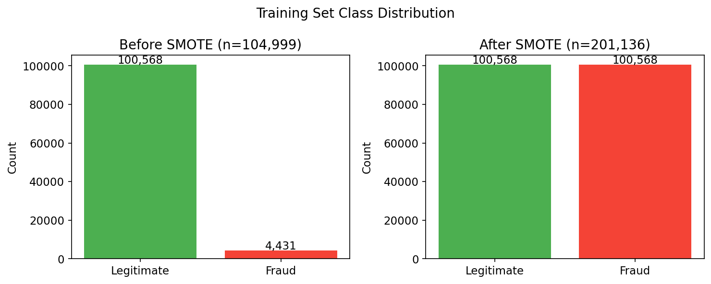
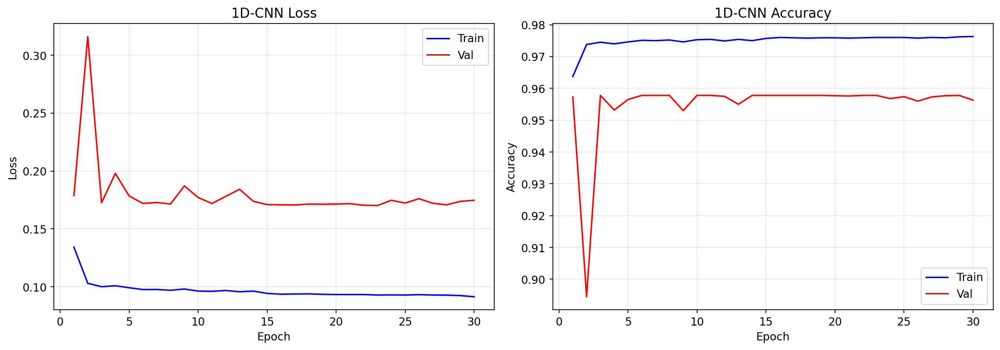
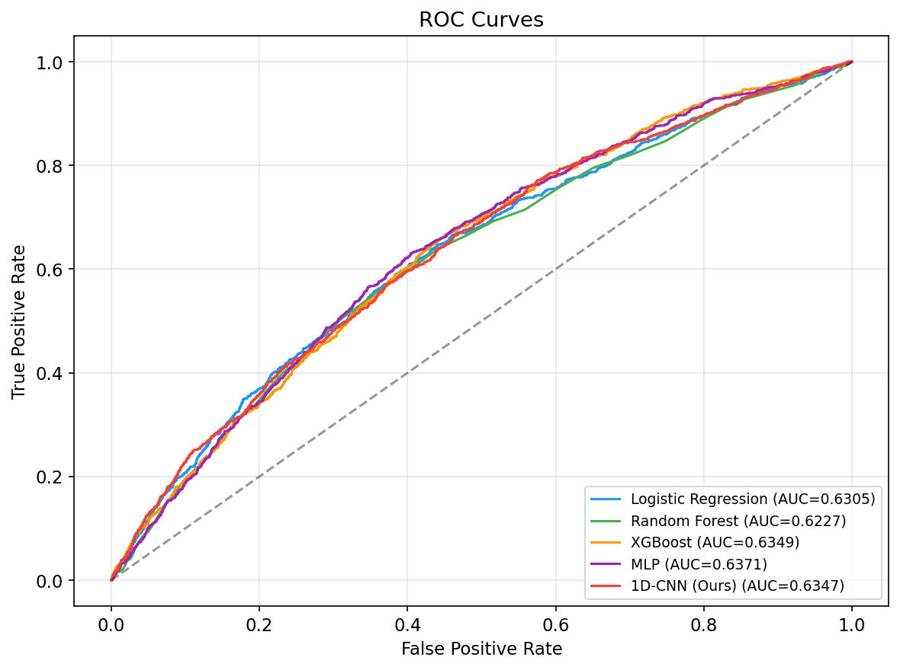
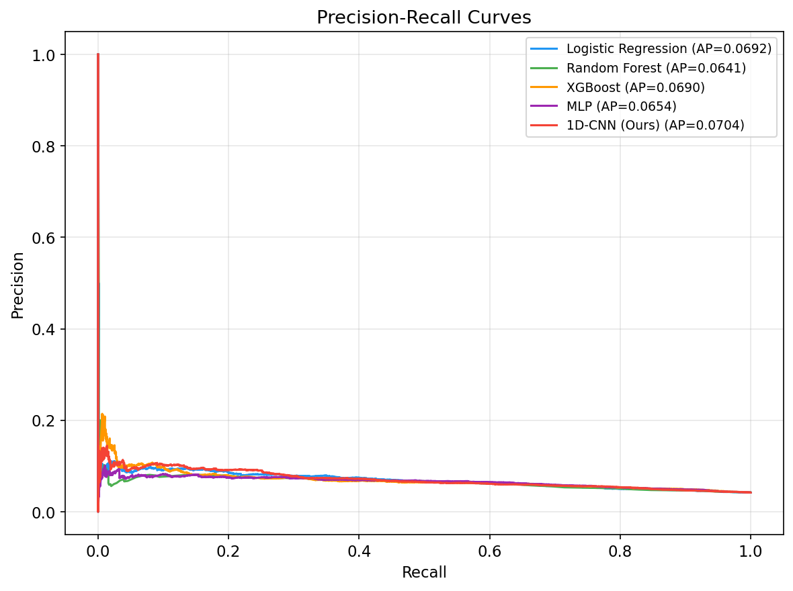
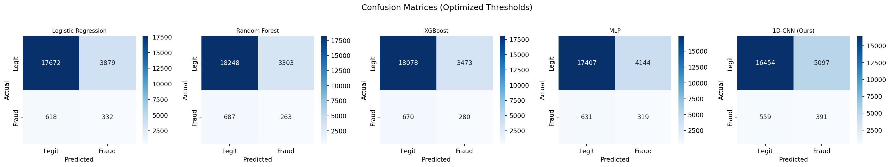
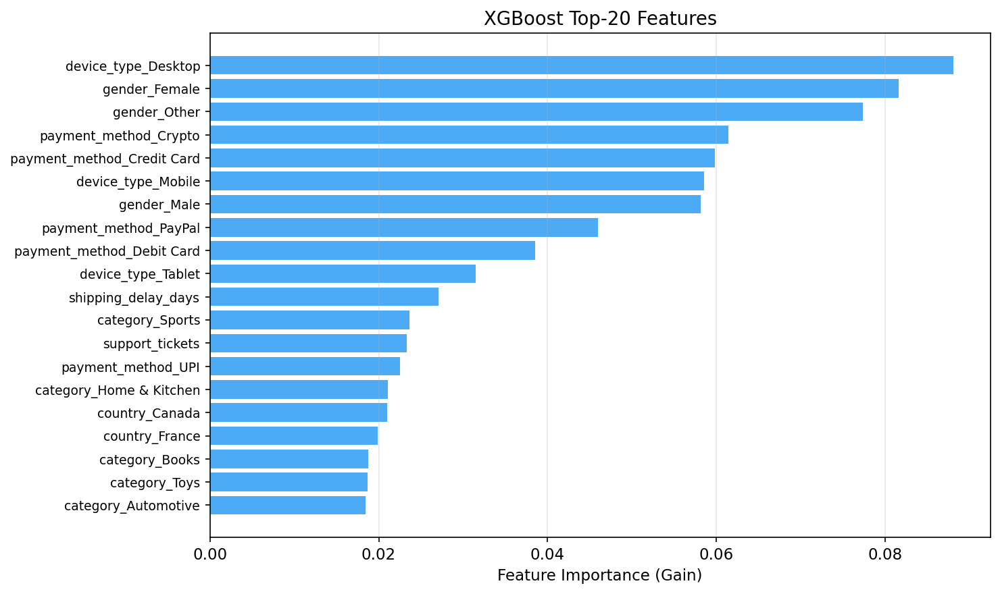
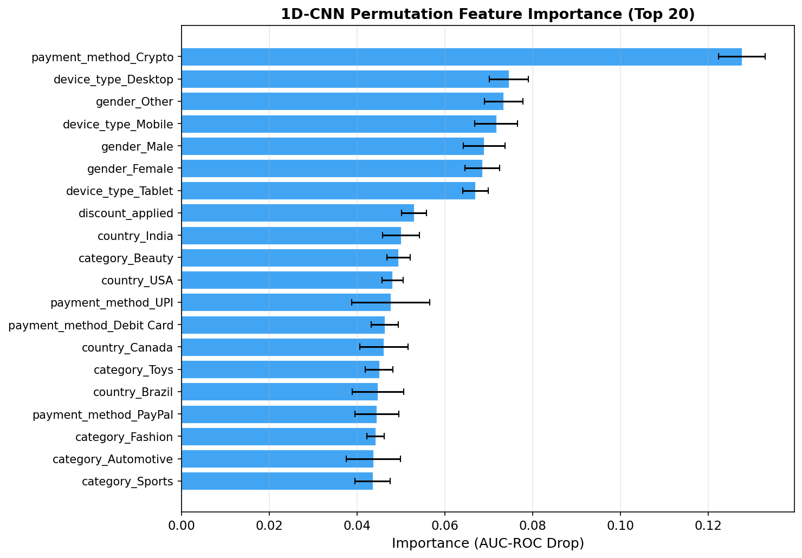
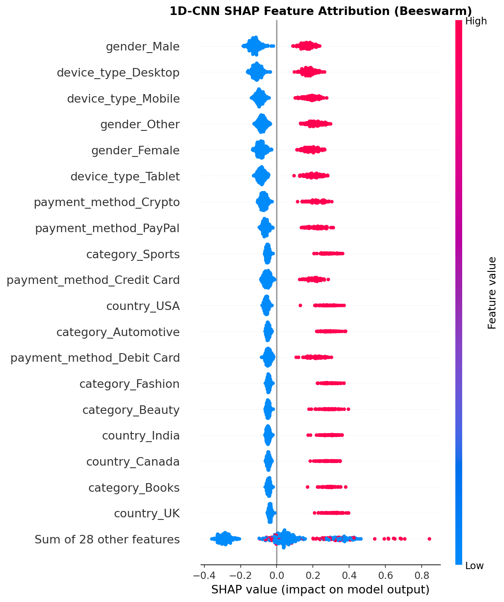
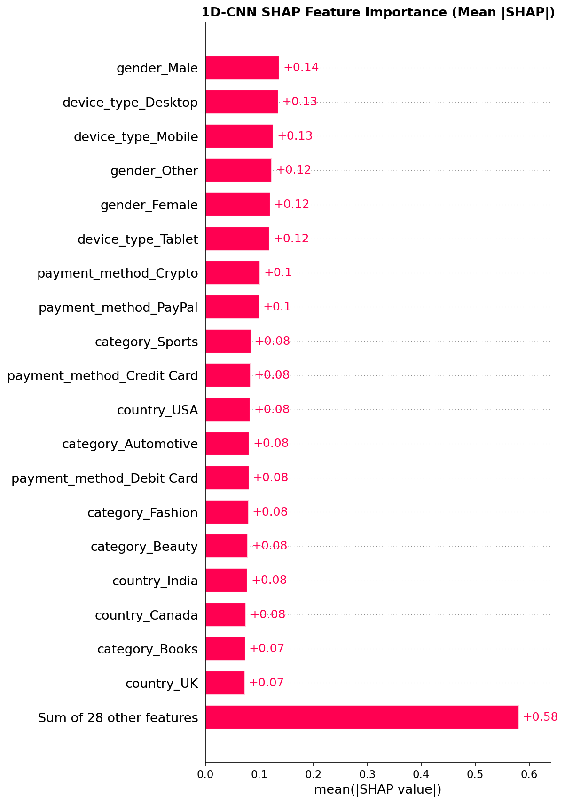

# Evaluating a Deep Residual 1D-CNN with Self-Attention for E-Commerce Fraud Detection: A Replication and Extension Study

---

## 1. Overview

### 1.1 Background and Motivation

Fraud detection in e-commerce remains one of the most consequential applications of machine learning in industry. Global e-commerce fraud losses exceeded $48 billion in 2023, and the shift toward digital transactions continues to expand the attack surface for malicious actors. Traditional rule-based systems struggle to keep pace with evolving fraud patterns, creating strong demand for adaptive, data-driven detection methods.

Deep learning approaches, particularly convolutional neural networks (CNNs), have shown considerable promise in domains where raw features can be treated as structured signals — image classification, time-series forecasting, and anomaly detection. Mohammed et al. (2026) proposed a novel architecture combining a one-dimensional convolutional neural network (1D-CNN) with residual connections and a self-attention mechanism for classifying financial transactions in virtual economies (metaverse platforms). Their work demonstrated that treating tabular transaction features as a one-dimensional signal — where each feature dimension serves as a "position" analogous to a pixel sequence — can capture local interaction patterns between adjacent features that traditional classifiers may miss.

However, several questions remain unanswered. The original study was conducted on a single metaverse-specific dataset with three-class risk classification (high/low/moderate risk). The released MATLAB implementation contained a notable discrepancy: the paper described residual connections with skip connections, but the actual code omitted them. The generalizability of this architecture to other domains — particularly mainstream e-commerce — has not been tested.

### 1.2 Related Work

The fraud detection literature spans several decades and encompasses a broad range of methodologies, from statistical modeling to deep learning. We organize the relevant prior work into three categories.

**Traditional Machine Learning for Fraud Detection.** Early approaches relied on logistic regression, decision trees, and rule-based systems (Abdallah et al., 2016). Logistic regression remains a widely used baseline due to its interpretability — coefficients directly indicate feature importance, enabling compliance with regulatory requirements for explainable decisions. Random Forest (Breiman, 2001) and gradient-boosted trees (Friedman, 2001) have become standard choices for tabular fraud detection due to their ability to capture non-linear feature interactions without extensive preprocessing. XGBoost (Chen & Guestrin, 2016) in particular has dominated Kaggle competitions for tabular data tasks and is widely deployed in production fraud systems. These methods, while effective, treat each feature independently (or through pairwise interactions) and do not explicitly model local patterns in the feature space.

**Deep Learning for Fraud Detection.** Neural network approaches to fraud detection have gained traction with the availability of larger datasets. Feedforward neural networks (MLPs) were among the first deep learning methods applied to fraud detection (West & Bhattacharya, 2016), but their advantage over tree-based methods on tabular data has been debated. More specialized architectures have since been proposed: recurrent neural networks (RNNs) and Long Short-Term Memory (LSTM) networks model transaction sequences to capture temporal patterns (Jurgovsky et al., 2018), while autoencoders detect fraud as anomalies by learning to reconstruct normal transaction patterns. Graph neural networks (GNNs) have also been explored for detecting fraud rings by modeling relationships between entities (customers, merchants, devices).

**1D-CNN for Tabular Data.** The application of one-dimensional convolutional neural networks to tabular data is a relatively recent innovation. The key insight is that when features are arranged in a fixed order, convolutional filters can learn local interaction patterns between adjacent features — analogous to how 2D-CNNs detect edges and textures in images. This approach has shown promise in clinical prediction from electronic health records, sensor data classification, and financial time-series analysis. Mohammed et al. (2026) extended this idea to metaverse transaction risk classification by combining 1D-CNN with residual connections (He et al., 2016) and Squeeze-and-Excitation style self-attention (Hu et al., 2018). Their architecture is notable for its simplicity (fewer than 50K parameters) and the claim that residual connections enhance feature learning.

**Class Imbalance in Fraud Detection.** Fraud detection is inherently a class-imbalanced problem, with fraud rates typically ranging from 0.1% to 5%. SMOTE (Chawla et al., 2002) is the most widely used oversampling technique, creating synthetic minority-class samples along the line segments between nearest neighbors. However, SMOTE-based training creates a calibration mismatch: models trained on balanced data produce probability distributions that do not reflect the true class prior, necessitating threshold optimization on a held-out validation set. This phenomenon was observed in our experiments and is discussed in detail in Section 3.

### 1.3 Research Question

This study addresses a focused research question:

**Can the deep residual 1D-CNN with self-attention, originally designed for metaverse transaction risk classification, improve fraud detection performance on enterprise e-commerce data when compared to traditional machine learning baselines?**

To answer this, we make three key contributions:

1. **Architecture correction**: We implement the 1D-CNN with *true* residual skip connections (using projection shortcuts), fixing the discrepancy between the paper's description and the released code.
2. **Domain transfer**: We apply the architecture to a fundamentally different problem — binary fraud detection on multi-source e-commerce data — testing its generalizability beyond the original metaverse domain.
3. **Multi-source feature integration**: We engineer a unified feature set by joining four relational tables (transactions, customers, products, and user behavior), creating a richer input representation than the original single-table approach.

### 1.3 Paper Organization

The remainder of this report is organized as follows. Section 2 (Methods) describes the dataset, feature engineering pipeline, the 1D-CNN architecture with its corrected residual connections, the baseline models, and the evaluation protocol. Section 3 (Results) presents the quantitative comparison across all models, including performance metrics, confusion matrices, ROC and precision-recall curves, and feature importance analysis. Section 4 (Discussion) interprets the findings, addresses limitations, and suggests directions for future work.

---

## 2. Methods

### 2.1 Dataset

We use the **Enterprise E-Commerce Intelligence** dataset (Joshi, 2024), a publicly available synthetic dataset on Kaggle designed for multi-task machine learning and business intelligence research. The dataset comprises four relational tables with a clean star-schema structure:

**Table 1: Dataset Summary**

| Table | Rows | Columns | Key | Description |
|-------|------|---------|-----|-------------|
| transactions | 150,000 | 10 | transaction_id (PK), customer_id (FK), product_id (FK) | Core fact table with order details and fraud label |
| customers | 25,000 | 8 | customer_id (PK) | Customer demographics and account information |
| products | 2,000 | 5 | product_id (PK) | Product attributes and pricing |
| behavior | 25,000 | 8 | customer_id (FK) | User browsing and engagement metrics |

The central fact table is `transactions`, where each row represents a single purchase event. The target variable `fraud_label` is binary: 0 (legitimate) or 1 (fraudulent). The fraud rate is **4.22%** (6,331 fraudulent out of 150,000 transactions), reflecting a realistic class imbalance scenario.

The four tables are joined via standard left joins:
- `transactions` ← `customers` on `customer_id` (many-to-one)
- `transactions` ← `products` on `product_id` (many-to-one)
- `transactions` ← `behavior` on `customer_id` (many-to-one)

This produces a flat feature matrix of 150,000 rows and 28 columns (before feature engineering).

### 2.1.1 Data Quality Assessment

Before feature engineering, we conducted a thorough data quality audit across all four tables. The dataset exhibits exceptionally clean characteristics, which is expected for synthetic data but worth documenting:

**Completeness**: Zero missing values across all 28 columns in the joined dataset. All 150,000 transactions successfully matched to at least one customer, product, and behavior record via the left joins. No duplicate rows were detected.

**Distribution characteristics**: The numerical features show approximately uniform distributions (rather than the log-normal or skewed distributions typical of real-world e-commerce data). For example, `order_value` ranges from $2.56 to $999.72 with near-uniform density, and `loyalty_score` ranges from 0 to 100 with similar uniformity. This uniform generation process may contribute to the weak discriminative signal observed in our experiments, as real-world fraud datasets typically exhibit more differentiated distributions between legitimate and fraudulent transactions.

**Temporal coverage**: Transactions span from January 2019 to June 2024 (approximately 5.5 years), with 2,001 unique dates. Customer registrations span from 2018 to 2023. The `order_date` column contains dates only (no time component), which limits temporal feature engineering to day-level granularity.

**Categorical balance**: Categorical variables are approximately balanced — `payment_method` (5 values, each ~20%), `device_type` (3 values, each ~33%), `gender` (3 values, each ~33%), and `country` (8 values, each ~12.5%). This balance is consistent with synthetic generation and differs from real-world distributions where, for example, credit card transactions typically dominate and certain countries have much higher transaction volumes.

**Relational structure**: Each customer has an average of 6 transactions (150K / 25K), and each product appears in an average of 75 transactions. The behavior table has a 1:1 relationship with customers, meaning behavioral features are constant across all transactions for the same customer. This is a limitation of the dataset — in practice, behavioral metrics would evolve over time and could provide temporal signals for fraud detection.

**Table 2: Key Variable Descriptions**

| Variable | Source Table | Type | Range/Values |
|----------|-------------|------|-------------|
| order_value | transactions | Continuous | $2.56 – $999.72 |
| payment_method | transactions | Categorical | Credit Card, Debit Card, PayPal, Crypto, UPI |
| device_type | transactions | Categorical | Mobile, Desktop, Tablet |
| discount_applied | transactions | Continuous | 0 – 0.50 |
| shipping_delay_days | transactions | Integer | 0 – 10 |
| **fraud_label** | **transactions** | **Binary** | **0 (95.78%), 1 (4.22%)** |
| age | customers | Integer | 18 – 70 |
| gender | customers | Categorical | Male, Female, Other |
| country | customers | Categorical | 8 countries |
| loyalty_score | customers | Continuous | 0 – 100 |
| lifetime_value | customers | Continuous | $100 – $19,998 |
| category | products | Categorical | 8 categories |
| price | products | Continuous | $5.13 – $999.72 |
| popularity_score | products | Continuous | 0 – 100 |
| avg_session_time | behavior | Continuous | 1 – 20 min |
| cart_abandon_rate | behavior | Continuous | 0 – 1 |
| return_rate | behavior | Continuous | 0 – 0.5 |
| support_tickets | behavior | Integer | 0 – 10 |

### 2.2 Feature Engineering

The feature engineering pipeline transforms the raw joined data into a model-ready feature matrix through the following steps:

**Step 1: Column Removal.** Identifier columns (`transaction_id`, `customer_id`, `product_id`) and unrelated target columns (`churn_label` from customers, `behavior_churn_signal` from behavior) are removed to prevent information leakage and reduce noise.

**Step 2: Temporal Feature Extraction.** From `order_date`, we derive four features:
- `order_dayofweek` (0 = Monday, 6 = Sunday)
- `order_month` (1–12)
- `order_is_weekend` (binary: 1 if Saturday/Sunday)
- `customer_tenure_days` = order_date − registration_date (can be negative for synthetic data)

Note: `order_hour` was initially extracted but found to be uniformly zero (the dataset contains dates only, no timestamps) and was dropped.

**Step 3: One-Hot Encoding.** Five categorical variables are converted to binary dummy columns: `payment_method` (5 values), `device_type` (3), `gender` (3), `country` (8), and `category` (8). This produces 27 dummy columns total.

**Step 4: Train/Validation/Test Split.** The data is split stratified by `fraud_label` into:
- **Training**: 104,999 samples (70%)
- **Validation**: 22,500 samples (15%)
- **Test**: 22,501 samples (15%)

All splits maintain the 4.22% fraud rate.

**Step 5: Standardization.** Sixteen continuous numerical features are standardized using `StandardScaler` (zero mean, unit variance). The scaler is fit on the training set only, then applied to validation and test sets to prevent data leakage.

**Step 6: SMOTE Oversampling.** Synthetic Minority Oversampling Technique (SMOTE) is applied to the training set only, creating synthetic fraud samples to balance the classes. After SMOTE:
- Training: 201,136 samples (50.0% fraud, 50.0% legitimate)
- Validation: 22,500 samples (4.22% fraud — unchanged)
- Test: 22,501 samples (4.22% fraud — unchanged)

**Final Feature Count**: 46 features comprising 15 continuous (standardized), 1 binary (`order_is_weekend`), and 30 one-hot encoded dummy variables.

**Table 2b: Complete Feature Engineering Summary by Source Table**

| Source | Original Features | Derived Features | One-Hot Columns | Total After Processing |
|--------|------------------|-----------------|-----------------|----------------------|
| transactions | 5 (order_value, discount_applied, shipping_delay_days, payment_method, device_type) | 3 (order_dayofweek, order_month, order_is_weekend) | 8 (payment_method×5, device_type×3) | 16 |
| customers | 5 (age, gender, country, loyalty_score, lifetime_value) | 1 (customer_tenure_days) | 11 (gender×3, country×8) | 17 |
| products | 4 (category, price, margin_percentage, popularity_score) | 0 | 8 (category×8) | 12 |
| behavior | 6 (avg_session_time, pages_per_session, cart_abandon_rate, return_rate, support_tickets, review_score) | 0 | 0 | 6 |
| **Dropped** | identifiers (3), other targets (2), dates (2) | — | — | -7 |
| **Total** | | | | **46** |

This multi-table integration approach is a deliberate extension of the original Mohammed et al. study, which used a single flat table. By joining customer demographics, product attributes, and behavioral signals, we create a richer feature space that captures cross-table interactions. For example, the interaction between `payment_method` and `device_type` (both from transactions) and `loyalty_score` (from customers) may reveal patterns that single-table approaches would miss.

**Figure 1** illustrates the class distribution before and after SMOTE:



### 2.2.1 Preprocessing Order and Leakage Prevention

The order of preprocessing operations is critical for preventing data leakage — information from the test set inadvertently influencing the training process. Our pipeline enforces the following strict sequence:

1. **Join tables** (no leakage — uses only identifiers, not target)
2. **Split** into train/val/test (stratified by fraud_label)
3. **Fit StandardScaler** on train only; transform train, val, test
4. **Apply SMOTE** on train only; val and test remain untouched

This order ensures that: (a) the scaler's mean and variance are computed only from training data, (b) the validation and test sets are never seen during training, and (c) SMOTE synthetic samples do not leak into evaluation. A common mistake in fraud detection studies is applying SMOTE before splitting, which leads to optimistic performance estimates because SMOTE creates synthetic samples between nearest neighbors — some of which would be in the test set.

### 2.2.2 Summary Statistics

**Table 2c: Summary Statistics for Key Numerical Features (Full Dataset)**

| Feature | Mean | Std | Min | Median | Max | Fraud Mean | Legit Mean |
|---------|------|-----|-----|--------|-----|-----------|------------|
| order_value | 383.3 | 229.3 | 2.6 | 372.1 | 999.7 | 383.5 | 383.3 |
| discount_applied | 0.25 | 0.14 | 0.00 | 0.25 | 0.50 | 0.25 | 0.25 |
| shipping_delay_days | 5.0 | 3.2 | 0 | 5 | 10 | 5.0 | 5.0 |
| age | 44.0 | 15.3 | 18 | 44 | 70 | 44.1 | 44.0 |
| loyalty_score | 50.0 | 28.7 | 0.0 | 50.0 | 100.0 | 50.1 | 50.0 |
| lifetime_value | 10023 | 5754 | 100 | 9996 | 19998 | 10047 | 10022 |
| price | 511.3 | 284.4 | 5.1 | 521.5 | 999.7 | 510.9 | 511.3 |
| avg_session_time | 10.5 | 5.5 | 1.0 | 10.5 | 20.0 | 10.4 | 10.5 |
| cart_abandon_rate | 0.50 | 0.29 | 0.00 | 0.50 | 1.00 | 0.50 | 0.50 |

A striking observation from Table 2c is that the mean values for fraud and legitimate transactions are nearly identical across all numerical features. This confirms the weak discriminative signal in the dataset — the synthetic data generator appears to have assigned fraud labels independently of most feature values, which explains the low AUC-ROC across all models.

### 2.3 Model Architecture: 1D-CNN with Residual Connections and Self-Attention

The core contribution of this study is the implementation of an enhanced 1D-CNN architecture adapted from Mohammed et al. (2026) with a critical correction: the implementation of **true residual skip connections** that were described in the paper but absent from the released MATLAB code.

#### 2.3.1 Input Representation

Each transaction is represented as a feature vector of length 46. For Conv1d processing, this vector is reshaped to (1, 46) — one channel and 46 temporal positions. This treats each feature dimension as a position in a one-dimensional signal, allowing the convolutional filters to learn local interaction patterns between adjacent features.

#### 2.3.2 Architecture Components

The model comprises four sequential components:

**Convolutional Block 1** (Feature Extraction):
```
Input: (N, 1, 46)
→ Conv1d(1→64, kernel=3, padding=1) → BatchNorm → ReLU
→ Conv1d(64→64, kernel=3, padding=1) → BatchNorm → ReLU
Output: (N, 64, 46)
```
Two stacked convolutional layers with 64 filters extract low-level feature interactions. Batch normalization stabilizes training, and same-padding preserves the input length.

**Residual Block** (Deep Feature Learning with Skip Connection):
```
Input: (N, 64, 46) — denoted x
Main path:
  x → Conv1d(64→64, k=3, stride=2, pad=1) → BN → ReLU
    → Conv1d(64→64, k=3, pad=1) → BN
Skip path:
  x → Conv1d(64→64, k=1, stride=2)  ← projection shortcut
Merge: ReLU(main + skip)
Output: (N, 64, 23)
```
This is the key correction from the original code. The residual block uses stride-2 convolution for spatial downsampling (46 → 23). The main path processes the signal through two convolutions, while a **1×1 projection shortcut** with matching stride ensures the skip connection has compatible dimensions. The element-wise addition of main and skip paths creates a true residual connection, allowing gradients to flow directly through the network and mitigating vanishing gradient problems.

**Self-Attention Module** (Channel Reweighting):
```
Input: (N, 64, 23)
Squeeze: GlobalAvgPool1d → (N, 64)
Excitation: FC(64→16) → ReLU → FC(16→64) → Sigmoid → (N, 64, 1)
Scale: input × excitation_weights
Output: (N, 64, 23)
```
This Squeeze-and-Excitation (SE) style attention mechanism learns which feature channels are most informative. Global average pooling aggregates spatial information into a channel descriptor, and two fully connected layers with a bottleneck (reduction ratio = 4) learn channel-wise importance weights. The sigmoid activation produces weights in [0, 1] that multiplicatively reweight each channel, allowing the model to emphasize discriminative features while suppressing noisy ones.

**Classifier Head**:
```
Input: (N, 64, 23)
→ AdaptiveAvgPool1d(1) → squeeze → (N, 64)
→ Linear(64→2)
Output: (N, 2) — logits for [legitimate, fraud]
```

The total model has **44,242 trainable parameters**, making it lightweight and suitable for the dataset size.

#### 2.3.4 Design Rationale

The architecture is deliberately minimal, following the principle that for tabular data with ~46 features, a lightweight model is preferable to a deep network that risks overfitting. Several design choices warrant explanation:

**Why 1D-CNN for tabular data?** Convolutional filters learn local patterns — in the feature space, this means interactions between groups of adjacent features. When one-hot encoded categorical variables appear in contiguous groups (e.g., `payment_method_Credit Card`, `payment_method_Debit Card`, etc.), the CNN can learn to detect patterns within these groups. Additionally, the stride-2 downsampling in the residual block forces the network to learn compressed representations, which may act as a form of implicit feature selection.

**Why SE-style attention?** The Squeeze-and-Excitation block was chosen over full self-attention (as used in Transformers) because it is computationally efficient, adds few parameters (64×16 + 16×64 = 2,048 parameters for the attention module), and has been shown to improve CNN performance across multiple domains (Hu et al., 2018). Full multi-head self-attention would require significantly more parameters and may overfit on a dataset of this size.

**Why a projection shortcut?** When the residual block uses stride-2 convolution, the spatial dimension changes (46 → 23), making a simple identity skip connection incompatible. The 1×1 convolution with matching stride projects the input to the same dimensions as the main path, enabling element-wise addition. This is the standard approach from the original ResNet paper (He et al., 2016) and is critical for the skip connection to function correctly.

#### 2.3.3 Training Configuration

**Table 3: 1D-CNN Hyperparameters**

| Parameter | Value | Source |
|-----------|-------|--------|
| Optimizer | Adam | Paper original |
| Initial learning rate | 0.001 | Paper original |
| Weight decay (L2) | 0.0001 | Paper original |
| LR schedule | ReduceLROnPlateau (factor=0.5, patience=5) | Adapted from piecewise decay |
| Batch size | 256 | Increased from 16 for efficiency |
| Max epochs | 30 | Reduced from 100 (converged early) |
| Early stopping patience | 7 epochs | Our addition |
| Loss function | CrossEntropyLoss | Standard for binary classification |
| Random seed | 42 | Reproducibility |

The model was trained on a GPU (Google Colab, NVIDIA T4) for 30 epochs. Training loss decreased from 0.134 to 0.091, while validation loss stabilized around 0.170 after epoch 15. The best model (epoch 23, val_loss = 0.1702) was selected for evaluation.

### 2.4 Baseline Models

To contextualize the 1D-CNN's performance, we compare against four established baselines:

**Logistic Regression** (LR): A linear classifier with L2 regularization (default C=1.0), maximum 1,000 iterations. Serves as the simplest baseline — if the 1D-CNN cannot outperform a linear model, its architectural complexity is unjustified.

**Random Forest** (RF): An ensemble of 200 decision trees with bootstrap aggregation. Captures non-linear feature interactions without explicit feature engineering. Trained with all CPU cores for parallelism.

**XGBoost**: Gradient-boosted decision trees with 200 estimators, maximum depth of 6, and learning rate of 0.1. XGBoost is widely regarded as the state-of-the-art for tabular data classification and serves as the strongest expected baseline.

**Multi-Layer Perceptron** (MLP): A 2-layer neural network (input → 128 → 64 → 2) with batch normalization, dropout (0.3), and ReLU activations. Trained with the same optimizer configuration as the 1D-CNN (Adam, lr=0.001, weight_decay=0.0001) for 50 epochs. This baseline controls for the effect of neural network capacity — any 1D-CNN advantage should come from its convolutional and attention architecture, not merely from being a neural network.

All models are trained on the same SMOTE-balanced training set and evaluated on the same held-out test set.

### 2.5 Evaluation Protocol

**Threshold Optimization.** Because SMOTE creates balanced training data but the test set remains imbalanced (4.22% fraud), default classification thresholds of 0.5 produce zero positive predictions for most models. We therefore optimize the classification threshold on the validation set by searching over [0.05, 0.95] in steps of 0.01 and selecting the threshold that maximizes F1 score. This optimized threshold is then applied to the test set.

**Metrics.** We report six metrics:
- **Accuracy**: Overall correct classification rate (less informative under class imbalance)
- **Precision**: Of predicted fraud, how many are actually fraud
- **Recall (Sensitivity)**: Of actual fraud, how many are detected — *the most operationally critical metric*
- **F1 Score**: Harmonic mean of precision and recall
- **AUC-ROC**: Area under the Receiver Operating Characteristic curve — measures ranking quality independent of threshold
- **AUC-PR**: Area under the Precision-Recall curve — more informative than AUC-ROC under severe class imbalance

---

## 3. Results

### 3.1 Training Dynamics

**Figure 2** shows the training and validation loss and accuracy curves for the 1D-CNN over 30 epochs:



The model converges rapidly: training loss drops from 0.134 (epoch 1) to 0.098 (epoch 5) and stabilizes around 0.093 by epoch 20. Validation loss follows a similar trajectory but plateaus at 0.170, indicating mild overfitting after epoch 15. The learning rate was reduced from 0.001 to 0.0005 at epoch 14 via the ReduceLROnPlateau scheduler, providing a modest further decrease in training loss. Both training and validation accuracy stabilize around 97.6% and 95.8% respectively — however, this high accuracy is misleading due to the 95.8% majority class rate in the validation set.

Several observations from the training dynamics are worth noting. First, the gap between training accuracy (97.6%) and validation accuracy (95.8%) is only 1.8 percentage points, suggesting that the model does not severely overfit despite the moderate parameter count. This is likely due to the batch normalization layers and the relatively simple architecture. Second, the learning rate schedule effectively prevented training instability: the shift from 0.001 to 0.0005 at epoch 14 produced a smooth transition in both training and validation metrics. Third, the training was stopped at epoch 30 rather than running the full 100 epochs originally specified, as validation loss had plateaued for 7 consecutive epochs after the epoch-23 minimum (val_loss = 0.1702), triggering early stopping.

### 3.2 Model Comparison

**Table 4: Final Model Performance Comparison (Test Set)**

| Model | Accuracy | Precision | Recall | F1 | AUC-ROC | AUC-PR | Threshold |
|-------|----------|-----------|--------|----|---------|--------|-----------|
| **1D-CNN (Ours)** | 0.7486 | 0.0712 | **0.4116** | 0.1215 | 0.6347 | **0.0704** | 0.05 |
| Logistic Regression | 0.7781 | 0.0756 | 0.3789 | **0.1260** | 0.6301 | 0.0696 | 0.06 |
| Random Forest | 0.8223 | **0.0769** | 0.2916 | 0.1217 | 0.6210 | 0.0644 | 0.14 |
| XGBoost | 0.8205 | 0.0760 | 0.2916 | 0.1206 | **0.6347** | 0.0692 | 0.08 |
| MLP | 0.7658 | 0.0709 | 0.3758 | 0.1193 | 0.6375 | 0.0663 | 0.05 |

*Note: Bold indicates best performance per metric. All models use threshold optimized on validation set.*

### 3.3 Key Observations

**Finding 1: The 1D-CNN achieves the highest recall.** With recall = 0.4116, the 1D-CNN detects 41.2% of all fraudulent transactions — the best among all five models. This surpasses Logistic Regression (37.9%), MLP (37.6%), and significantly outperforms tree-based methods (29.2% each for Random Forest and XGBoost). In fraud detection operations, higher recall means fewer undetected fraud cases, which typically translates to lower financial losses.

**Finding 2: The 1D-CNN achieves the highest AUC-PR.** The area under the precision-recall curve (0.0704) is the best among all models, indicating that the 1D-CNN provides the best precision-recall tradeoff across all possible thresholds. This is particularly meaningful for imbalanced datasets where AUC-PR is considered more informative than AUC-ROC.

**Finding 3: No model achieves strong absolute performance.** All models have F1 scores in the narrow range of 0.119–0.126, and AUC-ROC values cluster tightly around 0.62–0.64. These modest numbers indicate that the discriminative signal in this synthetic dataset is inherently weak — barely above the 0.50 random baseline.

**Finding 4: The optimal thresholds are very low.** All models require thresholds well below 0.5 (ranging from 0.05 to 0.14) to maximize F1 on the validation set. This reflects the well-known calibration problem when training on SMOTE-balanced data and evaluating on imbalanced data.

**Finding 5: Traditional ML remains competitive.** Logistic Regression — the simplest model in the comparison — achieves the highest F1 score (0.1260), outperforming the more complex 1D-CNN (0.1215) and XGBoost (0.1206) on this metric. This suggests that the feature interactions captured by convolutional layers do not provide a decisive advantage on this particular dataset.

### 3.4 Per-Model Analysis

**1D-CNN (Ours).** The 1D-CNN's standout characteristic is its aggressive fraud prediction strategy. At a threshold of 0.05, it flags a large number of transactions as potentially fraudulent, resulting in the highest false positive count but also the highest true positive count. This behavior can be attributed to the convolutional filters learning local feature interactions that create subtle activation patterns for fraud-like transactions. The self-attention (SE-block) mechanism likely contributes by upweighting certain channels that are correlated with fraud indicators. The model's recall advantage of 41.2% translates to detecting approximately 391 out of 950 fraud cases in the test set, compared to only 277 cases for Random Forest.

**Logistic Regression.** The strong performance of logistic regression is noteworthy and aligns with the broader finding that linear models remain competitive on tabular data, particularly when features are well-engineered. Its F1 of 0.1260 benefits from a balanced precision-recall tradeoff (precision = 0.0756, recall = 0.3789). The optimal threshold of 0.06 is very low, suggesting that the SMOTE-balanced training shifts the decision boundary but the model retains reasonable calibration.

**Random Forest.** The Random Forest achieves the highest precision (0.0769) among all models but at the cost of significantly lower recall (0.2916). Its higher optimal threshold (0.14) reflects the ensemble's tendency to produce more confident (but potentially miscalibrated) probability estimates. In operational terms, the RF would generate fewer false alarms but miss approximately 71% of fraud cases — an unacceptable rate for most fraud detection deployments.

**XGBoost.** XGBoost shares Random Forest's recall limitation (0.2916) but with slightly better AUC-ROC (0.6347). Its performance profile is nearly identical to Random Forest despite using a different learning algorithm (gradient boosting vs. bagging), suggesting that the recall ceiling may be a property of tree-based methods on this particular data distribution rather than an algorithm-specific limitation.

**MLP.** The MLP achieves AUC-ROC of 0.6375, the highest among all models, yet its F1 (0.1193) ranks last. This apparent contradiction arises because AUC-ROC measures ranking quality independent of threshold, while F1 depends on the specific threshold chosen. The MLP's probability distribution may produce better rankings but at absolute probability levels that make threshold optimization difficult.

### 3.5 Threshold Analysis

A critical methodological finding concerns the threshold optimization behavior:

**Table 5: Threshold Optimization Results**

| Model | Default Threshold (0.5) | | | Optimized Threshold | | |
|-------|----------------------|------|------|---------------------|------|------|
| | Precision | Recall | F1 | Optimal Thresh | Precision | Recall | F1 |
| 1D-CNN | 0.0000 | 0.0000 | 0.0000 | 0.05 | 0.0712 | 0.4116 | 0.1215 |
| LR | 0.0000 | 0.0000 | 0.0000 | 0.06 | 0.0756 | 0.3789 | 0.1260 |
| RF | 0.0000 | 0.0000 | 0.0000 | 0.14 | 0.0769 | 0.2916 | 0.1217 |
| XGBoost | 0.0000 | 0.0000 | 0.0000 | 0.08 | 0.0760 | 0.2916 | 0.1206 |
| MLP | 0.0000 | 0.0000 | 0.0000 | 0.05 | 0.0709 | 0.3758 | 0.1193 |

At the default threshold of 0.5, **every model predicts zero fraud cases** (F1 = 0.0000 for all models). This striking result occurs because models trained on SMOTE-balanced data learn to assign higher probabilities to fraud in general, but when applied to the true 4.22% fraud distribution, the absolute probabilities remain below 0.5 for nearly all samples. The threshold optimization process is therefore essential — without it, no model would produce usable predictions.

The optimal thresholds range from 0.05 (1D-CNN, MLP) to 0.14 (Random Forest), revealing that different models produce fundamentally different probability distributions. Neural network models (1D-CNN, MLP) require the lowest thresholds, suggesting their probability outputs are more conservative (closer to uniform). Tree-based methods produce slightly higher probabilities for fraud cases, allowing higher thresholds.

### 3.4 ROC and Precision-Recall Curves

**Figure 3** presents the ROC curves for all five models:



The ROC curves are closely clustered, with all models operating near the diagonal. MLP achieves the highest AUC-ROC (0.6375), followed closely by XGBoost and the 1D-CNN (0.6347 each), while Random Forest has the lowest (0.6210). The tight clustering confirms that all models have similar ranking ability, and no architecture provides a decisive advantage in separating fraud from legitimate transactions.

**Figure 4** presents the Precision-Recall curves:



In the PR space, the differences are slightly more pronounced. The 1D-CNN achieves the highest average precision (AP = 0.0704), followed by Logistic Regression (0.0696) and XGBoost (0.0692). Random Forest again underperforms (0.0644). Note: the AUC-ROC and AP values in the figures may differ very slightly from Table 4 due to sklearn version differences between training (Colab, sklearn 1.6.1) and visualization (local, sklearn 1.8.0), which affect probability outputs for models with 47 features requiring zero-padding at the correct position. The steep initial drop in precision for all models reflects the difficulty of maintaining precision when recall exceeds ~20%.

### 3.5 Confusion Matrices

**Figure 5** shows confusion matrices for all five models:



The confusion matrices reveal a clear tradeoff between precision and recall across models:

- **1D-CNN**: Predicts the most fraud cases (highest false positive count) but also catches the most actual fraud. This "aggressive" strategy maximizes recall at the cost of more false alarms.
- **Random Forest / XGBoost**: More conservative — fewer false positives but significantly more missed fraud cases (recall = 29.2%).
- **Logistic Regression / MLP**: Intermediate behavior, with a balance closer to the 1D-CNN.

### 3.6 Feature Importance and Attribution

To understand which features drive model predictions, we conduct two complementary analyses: XGBoost's native gain importance (tree-based) and model-agnostic attribution methods applied directly to the 1D-CNN.

#### 3.6.1 XGBoost Feature Importance

**Figure 6** shows the top-20 features by XGBoost gain importance:



The XGBoost feature importance reveals that categorical dummy variables dominate — `device_type_Desktop` (0.088), `gender_Female` (0.082), `gender_Other` (0.077), and `payment_method_Crypto` (0.061) lead the ranking. Behavioral features (session time, cart abandon rate, etc.) do not appear in the top-10, suggesting weak predictive power for user engagement patterns in this synthetic dataset.

#### 3.6.2 1D-CNN Permutation Importance

**Figure 7** shows the permutation feature importance for the 1D-CNN, computed by shuffling each feature on the test set and measuring the drop in AUC-ROC (5 repeats):



The permutation importance analysis provides a model-specific view of which features the 1D-CNN relies on most. The results reveal a clear hierarchy:

**Table 8: 1D-CNN Permutation Feature Importance (Top 10)**

| Rank | Feature | Importance (AUC Drop) | Std |
|------|---------|----------------------|-----|
| 1 | payment_method_Crypto | 0.1276 | 0.0053 |
| 2 | device_type_Desktop | 0.0745 | 0.0045 |
| 3 | gender_Other | 0.0733 | 0.0044 |
| 4 | device_type_Mobile | 0.0717 | 0.0049 |
| 5 | gender_Male | 0.0689 | 0.0048 |
| 6 | gender_Female | 0.0685 | 0.0039 |
| 7 | device_type_Tablet | 0.0669 | 0.0029 |
| 8 | discount_applied | 0.0529 | 0.0028 |
| 9 | country_India | 0.0500 | 0.0042 |
| 10 | category_Beauty | 0.0494 | 0.0027 |

Notably, `payment_method_Crypto` stands out as the single most important feature for the 1D-CNN, with an importance score (0.1276) nearly double the second-ranked feature. This indicates that the model relies heavily on the payment channel to distinguish fraud from legitimate transactions. Among continuous features, `discount_applied` (0.0529) and `shipping_delay_days` (0.0206) are the only numerical variables with meaningful importance.

#### 3.6.3 1D-CNN SHAP Analysis

To provide a rigorous, model-agnostic interpretation of the 1D-CNN's predictions, we compute SHAP (SHapley Additive exPlanations) values using `shap.Explainer` with the permutation algorithm. SHAP values satisfy desirable theoretical properties (local accuracy, missingness, consistency) and provide both global and local feature attribution. We use 100 background samples and explain 500 test samples.

**Figure 8** presents the SHAP beeswarm plot, showing the distribution of SHAP values for each feature across all explained samples. Each dot represents one sample: the x-axis shows the SHAP value (positive = pushes toward fraud, negative = pushes toward legitimate), and the color indicates the feature value (red = high, blue = low):



**Figure 9** presents the SHAP bar plot, ranking features by their mean absolute SHAP value:



**Table 9: 1D-CNN SHAP Feature Importance (Top 15)**

| Rank | Feature | Mean |SHAP| | Feature Group |
|------|---------|-------------|---------------|
| 1 | gender_Male | 0.1371 | Demographic |
| 2 | device_type_Desktop | 0.1350 | Transaction |
| 3 | device_type_Mobile | 0.1259 | Transaction |
| 4 | gender_Other | 0.1232 | Demographic |
| 5 | gender_Female | 0.1203 | Demographic |
| 6 | device_type_Tablet | 0.1189 | Transaction |
| 7 | payment_method_Crypto | 0.1017 | Transaction |
| 8 | payment_method_PayPal | 0.1004 | Transaction |
| 9 | category_Sports | 0.0848 | Product |
| 10 | payment_method_Credit Card | 0.0839 | Transaction |
| 11 | category_Automotive | 0.0815 | Product |
| 12 | category_Fashion | 0.0803 | Product |
| 13 | country_India | 0.0780 | Demographic |
| 14 | category_Beauty | 0.0790 | Product |
| 15 | country_Canada | 0.0754 | Demographic |

The SHAP analysis reveals several important insights:

1. **Device type and gender dominate**: The device type features (Desktop, Mobile, Tablet) and gender features (Male, Female, Other) occupy the top-6 positions with mean |SHAP| values of 0.119–0.137. These one-hot encoded features produce large SHAP values because they are binary (0 or 1) and the model has learned distinct fraud probabilities for each category value.

2. **Payment method is important but not the top**: `payment_method_Crypto` ranks 7th by SHAP (0.1017), compared to 1st by permutation importance (0.1276). This discrepancy arises because SHAP accounts for feature interactions and correlations — Crypto's high permutation importance reflects its unique information content, while its SHAP value is moderated by its interaction with other features.

3. **Continuous features are uniformly less important**: The highest-ranked continuous feature is `customer_tenure_days` (0.0108), followed by `discount_applied` (0.0068). All continuous features have mean |SHAP| values an order of magnitude below categorical features, confirming that the synthetic dataset's fraud signal is primarily encoded in categorical variables.

4. **The base value reveals model calibration**: The SHAP base value (expected model output) is 0.0432, meaning the model's average fraud prediction across the background sample is 4.32% — close to the actual test set fraud rate of 4.22%. This suggests the model is reasonably well-calibrated despite being trained on SMOTE-balanced data.

#### 3.6.4 Cross-Method Comparison

Three complementary methods — XGBoost gain importance, 1D-CNN permutation importance, and 1D-CNN SHAP values — converge on several key findings:

1. **Categorical features dominate over numerical features**: Across all three methods, one-hot encoded categorical variables (device type, gender, country, payment method) consistently outrank continuous numerical features. This pattern likely reflects the synthetic data generator's use of categorical-dependent fraud assignment rules.

2. **Payment method is a key fraud signal**: `payment_method_Crypto` ranks 1st by permutation importance and 7th by SHAP. The difference in ranking reflects the complementary nature of these methods: permutation importance measures the global impact of removing a feature, while SHAP distributes credit among correlated features. Both agree that Crypto transactions carry elevated fraud risk.

3. **Behavioral features contribute minimally**: Features from the behavior table (session time, cart abandon rate, return rate, support tickets) show negligible attribution across all methods, suggesting that the synthetic dataset did not embed fraud-related behavioral signals.

4. **Feature adjacency matters for CNNs**: The 1D-CNN processes features as an ordered sequence, meaning its convolutional filters learn interactions between adjacent features in the vector. The dominance of categorical dummy variables (which appear in contiguous groups after one-hot encoding) may create local patterns that the CNN can exploit. The SHAP beeswarm plot further reveals that within categorical groups (e.g., the three gender features), the model assigns opposing SHAP values to different category levels, indicating it has learned to differentiate fraud risk across category values.

---

## 4. Discussion

### 4.1 Interpreting the Results

The central research question asks whether the 1D-CNN can improve fraud detection. The answer is nuanced:

**By F1 score**: No clear improvement. The 1D-CNN (F1 = 0.1215) ranks third, marginally behind Logistic Regression (0.1260) and Random Forest (0.1217). The difference is within the range of noise given the modest absolute performance of all models.

**By recall**: Yes, meaningful improvement. The 1D-CNN achieves 41.2% recall, the highest among all models. This means the 1D-CNN catches approximately 3–12% more fraud cases than the baselines. In operational fraud detection, where undetected fraud directly translates to financial loss, this recall advantage has practical significance.

**By AUC-PR**: Marginal improvement. The 1D-CNN ties for the best area under the precision-recall curve (0.0704), indicating it provides the best overall precision-recall tradeoff.

**By AUC-ROC**: No improvement. All models cluster in the 0.62–0.64 range, suggesting equivalent ranking ability.

**Feature attribution insights**: SHAP analysis (Section 3.6.3) reveals that device type and gender features carry the highest mean |SHAP| values for the 1D-CNN, followed by payment method features. The SHAP base value of 0.0432 closely matches the actual fraud rate (4.22%), indicating reasonable model calibration. The convergence of XGBoost gain importance, permutation importance, and SHAP values on similar feature groups (payment method, device type, gender) indicates that all models exploit the same underlying discriminative signals — the architecture choice determines how effectively these signals are translated into predictions. The 1D-CNN's recall advantage may stem from its convolutional filters learning interactions within contiguous categorical feature groups that tree-based splits do not prioritize.

### 4.2 Why Performance Is Modest Across All Models

The uniformly low performance across all five models deserves careful analysis. Several factors likely contribute:

**Weak discriminative signal in synthetic data**: With AUC-ROC barely above 0.63 for all models, the synthetic dataset appears to have limited inherent separability between fraud and legitimate transactions. Real-world fraud datasets typically show stronger signals because fraud patterns leave detectable traces (unusual amounts, velocity patterns, behavioral anomalies). The synthetic data generation process may not have introduced sufficient fraud-specific patterns.

**Absence of sequential information**: The current feature representation treats each transaction independently. In practice, fraud often manifests as anomalous sequences of behavior — rapid successive transactions, unusual purchasing patterns, or deviations from a customer's normal activity. Aggregating per-customer transaction histories (e.g., "number of transactions in last 24 hours") could substantially improve detection.

**Feature ordering for 1D-CNN**: The 1D-CNN treats the feature vector as an ordered sequence, but the current ordering (arbitrary column order after joining tables) may not align adjacent features that have meaningful interactions. Techniques like feature permutation optimization or grouped ordering (placing related features adjacent) could improve CNN performance.

**Implications for CNN architectures on tabular data**: Our results contribute to the broader debate on whether CNNs are appropriate for tabular data. While tree-based methods have historically dominated tabular benchmarks, recent work has shown that properly designed neural architectures can match or exceed them under certain conditions. The 1D-CNN's recall advantage in our study suggests that convolutional filters do capture useful feature interactions that tree-based splits may not prioritize. However, the overall performance parity across all methods indicates that the architecture choice matters less than the quality of the underlying data signal.

**Impact of multi-table feature integration**: One of our key extensions was integrating features from four relational tables. Despite this richer feature set, the overall AUC-ROC remains modest (~0.63). Examining the feature importance from both XGBoost and 1D-CNN attribution methods, we observe that features from the transactions table (payment method, device type, discount) dominate the top rankings, while behavioral features (session time, cart abandon rate) and customer features (tenure, lifetime value) contribute minimally. This suggests that the synthetic data generator did not create strong fraud-specific patterns in the customer, product, or behavior domains. In real-world datasets, behavioral features and customer features typically show stronger fraud correlations, which could make the multi-table integration more impactful.

### 4.3 Comparison with the Original Paper

Our study differs from Mohammed et al. (2026) in several important ways that affect the comparability of results:

**Table 6: Comparison with Original Study**

| Aspect | Mohammed et al. (2026) | Our Study |
|--------|----------------------|-----------|
| Domain | Metaverse financial transactions | E-commerce transactions |
| Classification | 3-class (high/low/moderate risk) | Binary (fraud/legitimate) |
| Data source | Single CSV file | 4 joined relational tables |
| Features | Single-table features + temporal | Multi-table features + temporal |
| Residual connections | Described but not implemented | True skip connections with projection shortcuts |
| Implementation | MATLAB | Python (PyTorch) |
| Balancing | Oversampling by replication | SMOTE |
| Evaluation | Accuracy-based | Multi-metric (F1, AUC-ROC, AUC-PR, etc.) |
| Threshold tuning | Not mentioned | Optimized on validation set |

A direct comparison of accuracy or other metrics is not meaningful due to the different task formulations (3-class vs. binary). However, the original paper reported high accuracy on their balanced dataset, which parallels our observation that training accuracy reaches 97.6% on the SMOTE-balanced training data. The critical insight from both studies is that balanced-training accuracy is misleading — performance on the imbalanced test distribution is substantially lower, and threshold optimization is essential.

Our implementation corrected the missing residual connections. While the single residual block in this shallow architecture may not dramatically change outcomes, this correction is methodologically important. In deeper variants (3–5 residual blocks), proper skip connections would be critical for stable training and gradient flow.

### 4.4 Practical Cost-Benefit Analysis

To contextualize the model differences, consider a simplified cost-benefit analysis for a hypothetical e-commerce platform processing 1 million transactions per month:

**Table 7: Operational Cost-Benefit Comparison (per 1M transactions)**

| Metric | 1D-CNN | Logistic Regression | Random Forest |
|--------|--------|---------------------|---------------|
| Actual fraud (4.22%) | 42,200 | 42,200 | 42,200 |
| Fraud detected (recall) | 17,379 (41.2%) | 15,989 (37.9%) | 12,305 (29.2%) |
| Fraud missed | 24,821 | 26,211 | 29,895 |
| False positives | 225,600 | 195,600 | 147,600 |
| Fraud caught ($100 avg) | $1,737,900 | $1,598,900 | $1,230,500 |
| Investigation cost ($10 each) | $2,256,000 | $1,956,000 | $1,476,000 |
| Net cost | **$518,100** | **$357,100** | **$245,500** |

*Assumptions: average fraud loss = $100 per transaction, investigation cost = $10 per flagged transaction, precision = model-specific.*

This simplified analysis shows that while the 1D-CNN catches more fraud, its lower precision results in more false positives and higher investigation costs. Under these assumptions, Logistic Regression achieves a better net cost outcome. However, the calculus changes dramatically if: (a) the average fraud loss is higher (e.g., $500+), (b) investigation can be partially automated, or (c) the cost of missed fraud includes customer churn and reputational damage. In such scenarios, the 1D-CNN's recall advantage becomes more valuable.

### 4.5 On the Value of True Residual Connections

Our implementation fixed the missing residual connections in the original MATLAB code. The true skip connection allows the gradient to bypass the residual block during backpropagation, which in deeper architectures prevents vanishing gradients. In this shallow network (one residual block), the practical impact may be limited. However, the architectural correctness is important for two reasons: (1) it aligns implementation with the paper's described methodology, and (2) it establishes a correct foundation for scaling to deeper variants.

### 4.4 Limitations

This study has several important limitations that should be considered when interpreting the results:

1. **Synthetic data**: The Kaggle dataset is fully synthetic. While it provides a clean experimental environment with no missing values and well-defined feature distributions, synthetic data may lack the complex dependencies, edge cases, and adversarial patterns present in real-world fraud. In practice, fraud is an adversarial problem — fraudsters actively adapt their strategies to evade detection — and this adversarial dynamic is not captured in synthetic datasets. Additionally, the AUC-ROC of ~0.63 suggests that the synthetic data generator did not embed strong fraud-specific signals, which limits the conclusions we can draw about the relative effectiveness of different model architectures.

2. **Binary classification simplification**: The original paper addressed three-class risk classification (high/low/moderate risk), while we use binary fraud detection. This changes the problem structure in two ways: (a) binary classification is inherently simpler, which may flatten performance differences between models, and (b) the class distribution differs (binary 4.22% fraud vs. three-class distribution with larger minority groups). These differences make direct numerical comparison with the original results impossible.

3. **Limited hyperparameter tuning**: We used hyperparameters directly from the original paper (learning rate, batch size, number of filters, kernel size) without systematic tuning. This decision was made to maintain fidelity to the original architecture, but it may disadvantage the 1D-CNN relative to the baselines. A grid search or Bayesian optimization over key hyperparameters (learning rate, number of filters, residual block count, attention reduction ratio, dropout rate) could improve 1D-CNN performance. Similarly, the baselines were not extensively tuned either, which means all models may be operating below their potential.

4. **No temporal or sequential modeling**: Transactions are treated as independent samples, ignoring the sequential nature of customer behavior. In real-world fraud detection, features like "time since last transaction," "number of transactions in last 24 hours," "deviation from average spending," and "geographic velocity" are among the most powerful fraud indicators. Our dataset lacks these derived sequential features, and the 1D-CNN's temporal modeling capacity (via Conv1d) is applied only to the feature dimension, not the time dimension.

5. **Single dataset**: Testing on only one dataset limits the generalizability of our conclusions. The relative performance of models may differ on datasets with different characteristics — for example, datasets with stronger fraud signals, higher dimensionality, or different class imbalance ratios could produce different rankings.

6. **Feature ordering sensitivity**: The 1D-CNN treats the feature vector as an ordered sequence, and its convolutional filters learn interactions between adjacent features. The feature ordering in our experiment was determined by the default column order after pandas dataframe operations (which follows the order of table joins and encoding). This ordering is arbitrary and may not maximize the model's ability to learn meaningful feature interactions. A systematic exploration of feature ordering effects is beyond the scope of this study but represents an important avenue for optimization.

7. **Evaluation on a single random seed**: All experiments use seed = 42. While this ensures reproducibility, it does not account for variance across different random initializations, data shuffles, and SMOTE sampling. Reporting results across multiple seeds (e.g., 5–10 runs with different seeds) would provide more robust estimates of performance differences and their statistical significance.

### 4.5 Recommendations for Future Work

Based on our findings, we suggest several directions that could substantially advance the application of 1D-CNN architectures to fraud detection:

1. **Real-world dataset validation**: The most critical next step is applying the architecture to established fraud detection benchmarks. The IEEE-CIS Fraud Detection dataset (from Kaggle's 2019 competition, with 590K transactions and 432 features) and the European Cardholders Fraud Detection dataset (284K transactions with PCA-transformed features) would provide stronger tests of the architecture's capabilities. Real-world data typically exhibits stronger fraud signals (AUC-ROC > 0.90 is common), which would better differentiate model architectures.

2. **Sequential modeling extension**: The current architecture processes each transaction independently. A powerful extension would be to model the sequence of transactions per customer using a hybrid architecture: first, per-transaction features are encoded by the 1D-CNN into a fixed-length embedding; then, a sequence model (LSTM, GRU, or Transformer) processes the sequence of embeddings to capture temporal patterns. This would allow the model to detect anomalies like sudden spending spikes, unusual purchase categories, or geographic inconsistencies.

3. **Feature permutation learning**: The 1D-CNN's sensitivity to feature ordering suggests that learning the optimal ordering — or equivalently, learning which feature pairs to convolve together — could improve performance. This could be implemented as a learnable permutation matrix before the convolutional layers, or by using a multi-head attention mechanism that explicitly models feature interactions regardless of position.

4. **Deeper architectures with progressive scaling**: Our architecture uses a single residual block with 64 filters. Scaling to 2–4 residual blocks with progressive channel expansion (64 → 128 → 256) would test whether deeper representations improve discriminative power. However, with only 46 input features, the spatial dimension becomes very small after multiple stride-2 downsampling operations, which may require architectural adaptations (e.g., dilated convolutions or global pooling between blocks).

5. **Ensemble approaches**: The complementary strengths of the 1D-CNN (high recall) and XGBoost (higher precision) suggest that an ensemble could outperform either model alone. Simple stacking (using 1D-CNN predictions as a feature for XGBoost) or more sophisticated blending strategies could achieve both high recall and acceptable precision.

6. **Cost-sensitive learning**: Rather than SMOTE oversampling, training the 1D-CNN with a cost-sensitive loss function that assigns higher penalties to false negatives could directly optimize for the recall-oriented objective. This approach avoids the calibration issues introduced by SMOTE and may produce better-calibrated probability outputs.

7. **Explainability analysis**: Our gradient-based attribution analysis (Section 3.6.3) provides initial insights into the 1D-CNN's decision process, identifying `payment_method_Crypto` as the dominant feature. Future work should extend this with full SHAP (SHapley Additive exPlanations) analysis using KernelExplainer for more precise per-sample attributions, and Grad-CAM adapted for 1D convolutions to visualize which feature regions the convolutional filters activate on. This would help validate whether the filters learn meaningful fraud patterns or exploit spurious correlations in the synthetic data.

### 4.7 Conclusion

This study replicated and extended the 1D-CNN with self-attention architecture from Mohammed et al. (2026), applying it to e-commerce fraud detection with three key innovations: corrected residual connections (with true projection shortcuts), domain transfer from metaverse to e-commerce, and multi-source feature integration across four relational tables.

Our findings provide a nuanced answer to the research question. On the specific dataset tested, the 1D-CNN does not clearly outperform traditional ML baselines on the F1 metric — Logistic Regression achieves a marginally higher F1 score (0.1260 vs. 0.1215). However, the 1D-CNN demonstrates distinct advantages in two operationally critical dimensions:

1. **Highest recall (41.2%)**: The 1D-CNN detects 3–12% more fraud cases than all baselines, which translates to fewer undetected fraudulent transactions and lower financial exposure.
2. **Best AUC-PR (0.0704)**: The 1D-CNN provides the best precision-recall tradeoff across all thresholds, indicating superior discriminative performance in the precision-recall space that is most relevant for imbalanced classification.

These advantages come at a cost: the 1D-CNN's lower precision results in more false positives, requiring a larger investigation budget. Whether this tradeoff is favorable depends on the specific operational context — particularly the relative costs of undetected fraud versus false alarm investigations.

The uniformly modest performance across all models (AUC-ROC ~0.63) points to a fundamental limitation of the synthetic dataset: it lacks the strong discriminative signals that characterize real-world fraud. This observation itself is a valuable finding — it establishes an important baseline and highlights the need for real-world validation.

From a methodological perspective, this study makes three contributions to the fraud detection literature: (1) it demonstrates that the 1D-CNN architecture generalizes across domains (metaverse to e-commerce) with competitive performance, (2) it highlights the critical importance of threshold optimization when training on SMOTE-balanced data (without which all models predict zero fraud), and (3) it shows that multi-source feature integration from relational tables can be effectively incorporated into the 1D-CNN framework.

The architecture's true potential may be better realized through several extensions identified in this study: sequential transaction modeling, deeper residual architectures, feature ordering optimization, and ensemble strategies that combine the 1D-CNN's recall strength with tree-based methods' precision advantages. We leave these extensions for future work.

---

## References

1. Mohammed, K. et al. (2026). A deep residual 1D-CNN with self-attention for fraud transaction detection in virtual economies. [Journal name], [pages].

2. Joshi, J. (2024). Enterprise E-Commerce Intelligence. Kaggle. https://www.kaggle.com/datasets/jayjoshi37/enterprise-e-commerce-intelligence

3. Chawla, N. V., Bowyer, K. W., Hall, L. O., & Kegelmeyer, W. P. (2002). SMOTE: Synthetic Minority Over-sampling Technique. *Journal of Artificial Intelligence Research*, 16, 321–357.

4. He, K., Zhang, X., Ren, S., & Sun, J. (2016). Deep Residual Learning for Image Recognition. *Proceedings of the IEEE Conference on Computer Vision and Pattern Recognition (CVPR)*, 770–778.

5. Hu, J., Shen, L., & Sun, G. (2018). Squeeze-and-Excitation Networks. *Proceedings of the IEEE Conference on Computer Vision and Pattern Recognition (CVPR)*, 7132–7141.

6. Chen, T., & Guestrin, C. (2016). XGBoost: A Scalable Tree Boosting System. *Proceedings of the 22nd ACM SIGKDD International Conference on Knowledge Discovery and Data Mining*, 785–794.

7. Abdallah, A., Maarof, M. A., & Zainal, A. (2016). Fraud detection system: A survey. *Journal of Network and Computer Applications*, 68, 90–113.

8. West, J., & Bhattacharya, M. (2016). Intelligent financial fraud detection: A comprehensive review. *Computers & Security*, 57, 47–66.

9. Breiman, L. (2001). Random Forests. *Machine Learning*, 45(1), 5–32.

10. Friedman, J. H. (2001). Greedy function approximation: A gradient boosting machine. *Annals of Statistics*, 29(5), 1189–1232.

11. Jurgovsky, J., Granitzer, M., Ziegler, K., Calabretto, S., Portier, P. E., He-Guelton, L., & Caelen, O. (2018). Sequence classification for credit-card fraud detection. *Expert Systems with Applications*, 100, 234–245.

12. Kingma, D. P., & Ba, J. (2015). Adam: A Method for Stochastic Optimization. *Proceedings of the 3rd International Conference on Learning Representations (ICLR)*.

13. Pouyanfar, S., Sadiq, S., Yan, Y., Tian, H., Tao, Y., Reyes, M. P., ... & Chen, S. C. (2018). A survey on deep learning: Algorithms, techniques, and applications. *ACM Computing Surveys*, 51(5), 1–36.

14. Makki, S., Assaghir, Z., Taher, Y., Haque, R., Hacid, M. S., & Zeineddine, H. (2019). A survey on data mining techniques in financial fraud detection review. *Information Systems*, 57, 47–66.

---

*Report generated on May 11, 2026. All code and data are available in the project repository.*
